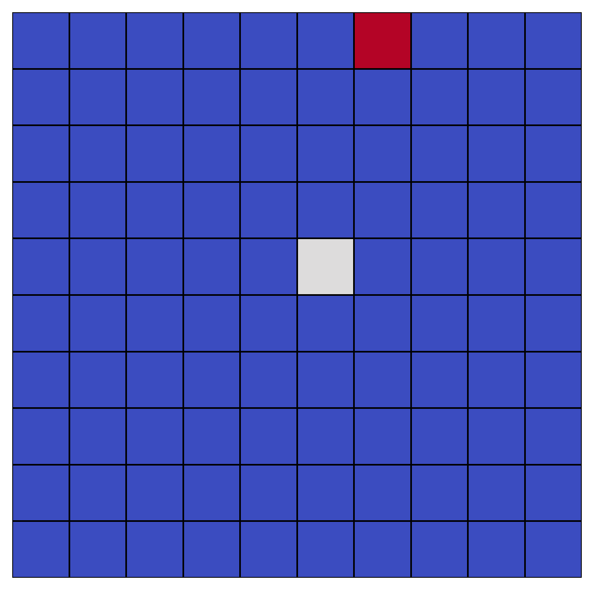

# LLM Grid World

## Cellular Automata Based On LLM Decisions

### Some Proof-of-Concept small fun projects where agents live in a grid-like world and make decisions based on Large Language Models (LLMs).

* Simple Grid World:

Example is in `grid_world_explore.ipynb`.  

The agent is a white square. The food is a red square (placed randomly). 
At every step LLM decides as an agent which way to go based on the current state of the grid.

  
   

 
